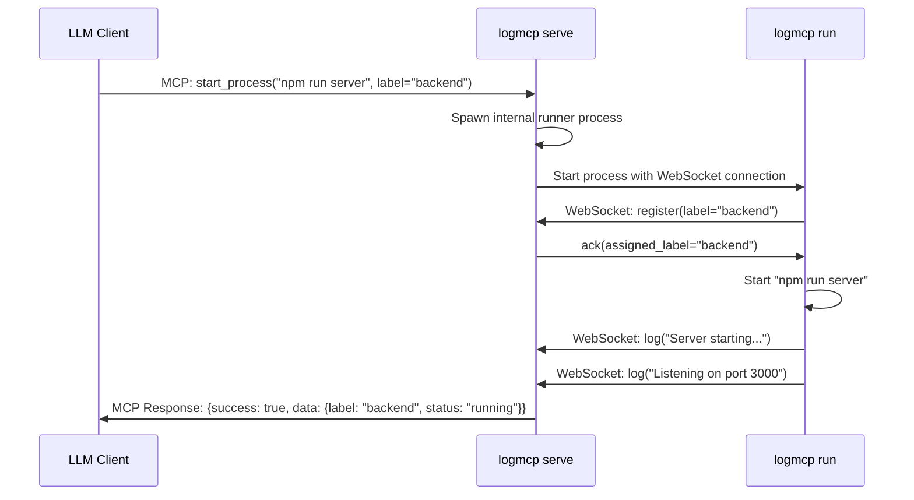
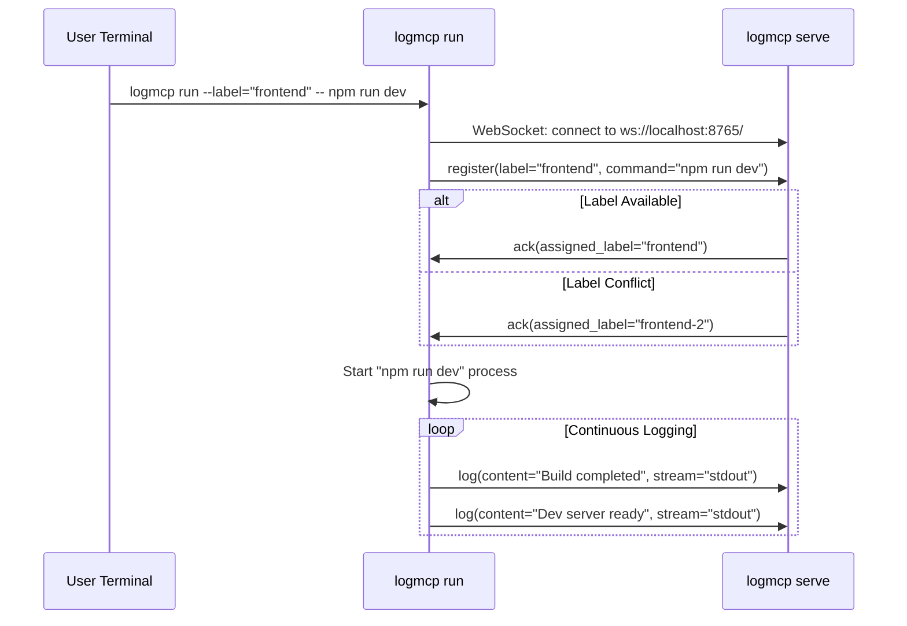
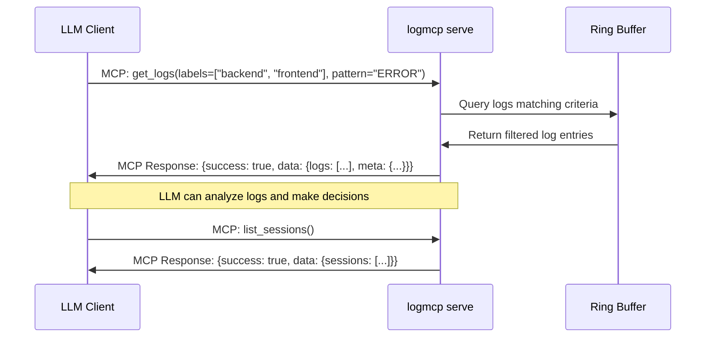
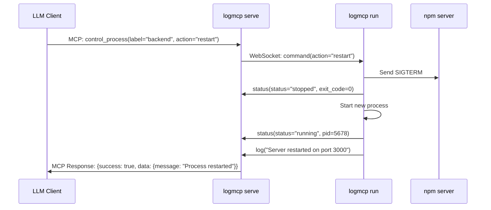
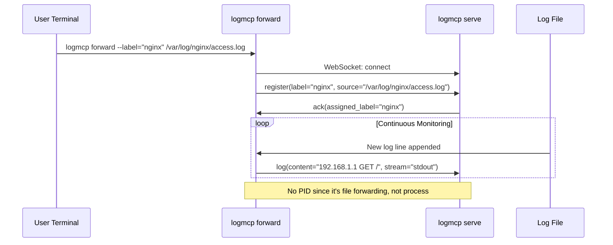
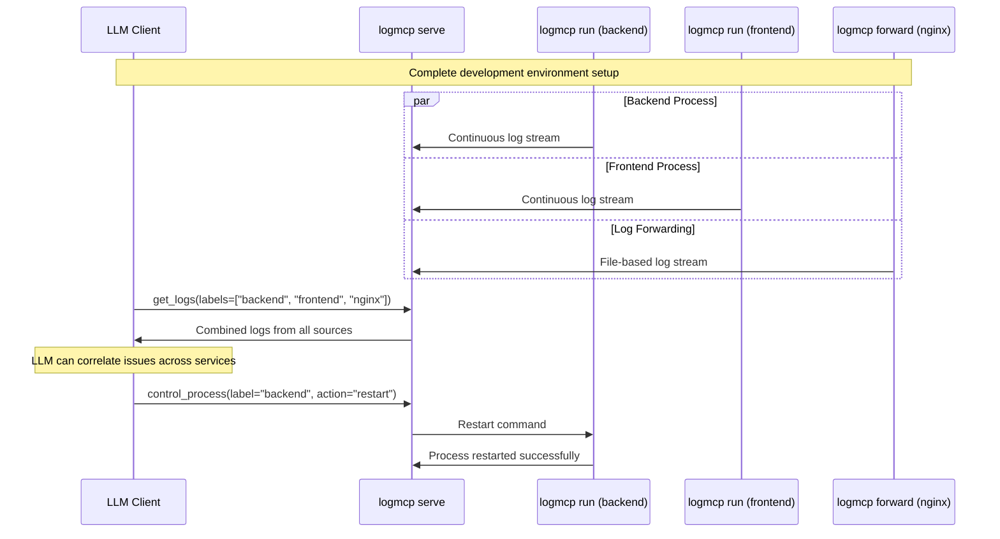

# LogMCP Technical Specification

## Overview

LogMCP is a Model Context Protocol (MCP) server that provides real-time log streaming and process management capabilities for debugging and troubleshooting. It enables LLMs to observe and control processes through a unified interface.

## Goals

- Enable LLMs to access real-time logs from multiple processes
- Provide process lifecycle management (start/stop/restart)
- Support both local and remote log forwarding
- Maintain short-term log history for debugging (5 minutes or 5MB ring buffer)
- Unified protocol for all log sources and process management

## Architecture

### Components

1. **LogMCP Server** (`logmcp serve`)
   - WebSocket server for log ingestion from runners
   - MCP interface for LLM interaction
   - Ring buffer management per session
   - Process lifecycle management

2. **Process Runner** (`logmcp run <command>`)
   - Wraps and executes commands
   - Captures stdout/stderr
   - Streams logs via WebSocket to server

3. **Log Forwarder** (`logmcp forward <source>`)
   - Forwards logs from existing processes/files
   - Connects to server via WebSocket

### Technology Stack

- **Language**: Go
- **WebSocket Library**: gorilla/websocket
- **Protocol**: JSON over WebSocket
- **Buffer**: In-memory ring buffer (5 minutes or 5MB limit)

## LLM Commands (MCP Interface)

The following commands are available to LLMs through the MCP interface:

- **list_sessions** - Get a list of all active log sessions with their status, process information, and buffer statistics
- **get_logs** - Retrieve and search log entries from one or more sessions, with options to filter by time range, line count, stream type (stdout/stderr), and regex patterns
- **start_process** - Launch a new managed process with specified command, working directory, environment variables, restart policies, and optional startup log collection
- **control_process** - Send control commands to managed processes (restart, signal) with specific signal names (SIGTERM, SIGKILL)
- **send_stdin** - Send input directly to a process's stdin for interactive commands or configuration

## Server-Runner Communication

The WebSocket protocol between the server and runners supports bidirectional communication with the following message types:

### Runner to Server Messages

- **Session Registration** - Runner announces itself with label, command details, working directory, and available capabilities
- **Log Entries** - Continuous stream of log lines with metadata including timestamp, stream type (stdout/stderr), process ID, and content
- **Status Updates** - Process state changes such as started, stopped, crashed, or restarting, including exit codes and descriptive messages
- **Capability Announcements** - What features the runner supports (process control, stdin forwarding, file watching, etc.)

### Server to Runner Messages

- **Process Control Commands** - Instructions to restart the managed process or send specific Unix signals (SIGTERM, SIGKILL)
- **Stdin Forwarding** - Input data to be sent to the process's stdin stream for interactive applications
- **Configuration Updates** - Changes to logging verbosity, filtering rules, or buffer settings
- **Health Checks** - Ping requests to verify runner connectivity and responsiveness

## Command Line Interface

### Server Mode
```bash
logmcp serve [--websocket-port PORT] [--host HOST]
```
- Default websocket-port: 8765
- Default host: localhost
- Exposes MCP interface via stdio
- WebSocket endpoint: ws://HOST:PORT/

### Process Runner Mode
```bash
logmcp run [--label LABEL] [--server-url URL] -- <command>
```
- Wraps and executes command
- Streams stdout/stderr to server
- Auto-generates label if none provided (session-1, session-2, etc.)
- Default server-url: ws://localhost:8765

### Log Forwarder Mode
```bash
logmcp forward [--label LABEL] [--server-url URL] <source>
```
- Sources: file paths, stdin, named pipes
- Default server-url: ws://localhost:8765
- Examples:
  - `logmcp forward --label="nginx" /var/log/nginx/access.log`
  - `kubectl logs -f pod | logmcp forward --label="k8s-app"`

## WebSocket Protocol

### Message Types

#### Log Message (Runner → Server)
```json
{
  "type": "log",
  "session_id": "backend-1",
  "label": "backend",
  "content": "Server started on port 3000",
  "timestamp": "2025-06-30T10:30:00.123Z",
  "stream": "stdout",
  "pid": 1234
}
```

#### Command Message (Server → Runner)
```json
{
  "type": "command",
  "session_id": "backend-1",
  "action": "restart|signal",
  "signal": "SIGTERM|SIGKILL|SIGINT|SIGHUP|SIGUSR1|SIGUSR2"
}
```

#### Stdin Message (Server → Runner)
```json
{
  "type": "stdin",
  "session_id": "backend-1",
  "input": "reload config\n"
}
```

#### Acknowledgment Message (Runner → Server)
```json
{
  "type": "ack",
  "session_id": "backend-1", 
  "command_id": "restart-123",
  "success": true,
  "message": "Process restarted with PID 5678",
  "new_pid": 5678
}
```

#### Error Message (Bidirectional)
```json
{
  "type": "error",
  "session_id": "backend-1",
  "error_code": "PROCESS_NOT_FOUND", 
  "message": "Cannot send signal to non-existent process",
  "details": {}
}
```#### Status Message (Runner → Server)
```json
{
  "type": "status",
  "session_id": "backend-1",
  "status": "running|stopped|crashed|restarting",
  "pid": 1234,
  "exit_code": null,
  "message": "Process restarted successfully"
}
```

#### Session Registration (Runner → Server)
```json
{
  "type": "register",
  "session_id": "backend-1",
  "label": "backend",
  "command": "npm run server",
  "working_dir": "/app",
  "capabilities": ["process_control", "stdin"]
}
```

#### Acknowledgment Message (Server → Runner)
```json
{
  "type": "ack",
  "session_id": "backend", 
  "command_id": "cmd-123",
  "success": true,
  "message": "Command executed successfully"
}
```

#### Error Message (Bidirectional)
```json
{
  "type": "error",
  "session_id": "backend",
  "error_code": "PROCESS_NOT_FOUND",
  "message": "Process with PID 1234 not found"
}
```

### Connection Flow

1. Runner connects to WebSocket server at `ws://localhost:8765/`
2. Runner sends registration message with preferred label
3. Server responds with assigned label (handles conflicts automatically)
4. Runner uses assigned label for all subsequent messages
5. Bidirectional communication for logs and commands
6. Runner sends status updates on process changes

## MCP Interface

**Transport**: Standard MCP over stdio (built-in to logmcp serve)

The following tools are available to LLMs through the MCP interface:

### Tools

#### `list_sessions`
```json
{
  "name": "list_sessions",
  "description": "List all active log sessions",
  "inputSchema": {
    "type": "object",
    "properties": {}
  }
}
```

**Response:**
```json
{
  "success": true,
  "data": {
    "sessions": [
      {
        "label": "backend",
        "status": "running",
        "pid": 1234,
        "command": "npm run server",
        "working_dir": "/app/backend",
        "start_time": "2025-06-30T10:30:00Z",
        "exit_time": null,
        "log_count": 150,
        "buffer_size": "2.3MB",
        "exit_code": null,
        "runner_mode": "run",
        "runner_args": {
          "command": "npm run server",
          "label": "backend"
        }
      }
    ]
  },
  "meta": {
    "total_count": 1,
    "active_count": 1
  }
}
```

#### `get_logs`
```json
{
  "name": "get_logs",
  "description": "Get and search logs from one or more sessions",
  "inputSchema": {
    "type": "object",
    "properties": {
      "labels": {"type": "array", "items": {"type": "string"}, "description": "Session labels to query (single or multiple)"},
      "lines": {"type": "number", "default": 100},
      "since": {"type": "string", "description": "ISO timestamp"},
      "stream": {"type": "string", "enum": ["stdout", "stderr", "both"], "default": "both"},
      "pattern": {"type": "string", "description": "Regex pattern to filter log entries"},
      "max_results": {"type": "number", "default": 1000, "description": "Maximum results across all sessions"}
    },
    "required": ["labels"]
  }
}
```

**Response:**
```json
{
  "success": true,
  "data": {
    "logs": [
      {
        "label": "backend",
        "content": "Server started on port 3000",
        "timestamp": "2025-06-30T10:30:15.123Z",
        "stream": "stdout",
        "pid": 1234
      },
      {
        "label": "backend", 
        "content": "Database connection established",
        "timestamp": "2025-06-30T10:30:16.456Z",
        "stream": "stdout",
        "pid": 1234
      },
      {
        "label": "frontend",
        "content": "ERROR: Failed to load config",
        "timestamp": "2025-06-30T10:30:17.789Z", 
        "stream": "stderr",
        "pid": 5678
      }
    ]
  },
  "meta": {
    "total_results": 3,
    "truncated": false,
    "sessions_queried": ["backend", "frontend"],
    "sessions_not_found": [],
    "time_range": {
      "oldest": "2025-06-30T10:30:15.123Z",
      "newest": "2025-06-30T10:30:17.789Z"
    }
  }
}
```

#### `control_process`
```json
{
  "name": "control_process",
  "description": "Control a managed process",
  "inputSchema": {
    "type": "object",
    "properties": {
      "label": {"type": "string"},
      "action": {"type": "string", "enum": ["restart", "signal"]},
      "signal": {"type": "string", "enum": ["SIGTERM", "SIGKILL"], "description": "Signal to send (required for signal action)"}
    },
    "required": ["label", "action"]
  }
}
```

**Response:**
```json
{
  "success": true,
  "data": {
    "message": "Signal SIGTERM sent to process 1234",
    "session": {
      "label": "backend",
      "status": "running",
      "pid": 1234
    }
  }
}
```

#### `send_stdin`
```json
{
  "name": "send_stdin",
  "description": "Send input to a process stdin",
  "inputSchema": {
    "type": "object",
    "properties": {
      "label": {"type": "string"},
      "input": {"type": "string"}
    },
    "required": ["label", "input"]
  }
}
```

**Response:**
```json
{
  "success": true,
  "data": {
    "message": "Input sent to process stdin",
    "bytes_sent": 15
  }
}
```

## Data Structures

### Ring Buffer
- **Capacity**: 5 minutes of logs OR 5MB, whichever comes first
- **Behavior**: FIFO, oldest entries dropped when limit reached
- **Indexing**: Support timestamp-based and line-based access
- **Thread Safety**: Concurrent read/write safe

### Session
```go
type Session struct {
    ID           string        // User-provided or auto-generated unique identifier
    Label        string        // User-friendly name (can be duplicate)
    Command      string        // Command being executed (for run mode) or source description
    WorkingDir   string        // Working directory where process was started
    Status       SessionStatus
    PID          int
    ExitCode     *int          // nil if still running, exit code if terminated
    StartTime    time.Time
    ExitTime     *time.Time    // nil if still running, exit time if terminated
    LogBuffer    *RingBuffer
    Connection   *websocket.Conn
    Process      *os.Process
    Capabilities []string
    RunnerMode   RunnerMode    // How this session was created
    RunnerArgs   interface{}   // Mode-specific arguments (JSON serializable)
}

type SessionStatus string
const (
    StatusRunning    SessionStatus = "running"
    StatusStopped    SessionStatus = "stopped" 
    StatusCrashed    SessionStatus = "crashed"
    StatusRestarting SessionStatus = "restarting"
)

type RunnerMode string
const (
    ModeRun     RunnerMode = "run"      // logmcp run <command>
    ModeForward RunnerMode = "forward"  // logmcp forward <source>
    ModeManaged RunnerMode = "managed"  // Started via MCP start_process
)

// RunnerArgs examples for different modes:
type RunArgs struct {
    Command string `json:"command"`
    Label   string `json:"label"`
}

type ForwardArgs struct {
    Source string `json:"source"`
    Label  string `json:"label"`
}

type ManagedArgs struct {
    Command     string            `json:"command"`
    Label       string            `json:"label"`
    WorkingDir  string            `json:"working_dir"`
    Environment map[string]string `json:"environment"`
}
```

### Ring Buffer Implementation
- **Per-session**: Each session has its own 5MB/5min buffer
- **Eviction**: When either limit is reached, oldest entries are removed (FIFO)
- **Thread safety**: Protected by sync.RWMutex for concurrent access
- **Line limits**: Individual log lines capped at 64KB to prevent memory exhaustion
- **Behavior**: Time-based eviction runs every 30 seconds, size-based is immediate

### Session Management
- **Session IDs**: Auto-generated UUID v4 if not provided by user
- **Label conflicts**: Multiple sessions can share the same label
- **Disconnection handling**: Managed processes continue running, marked as "disconnected" status
- **Cleanup**: Sessions auto-removed 1 hour after process termination and runner disconnection

### Log Entry
```go
type LogEntry struct {
    Label     string
    Content   string
    Timestamp time.Time
    Stream    StreamType
    PID       int
}

type StreamType string
const (
    StreamStdout StreamType = "stdout"
    StreamStderr StreamType = "stderr"
)
```

## Implementation Details

### Server Components

1. **WebSocket Handler**
   - Accept connections from runners
   - Route messages based on type
   - Handle connection lifecycle

2. **Session Manager**
   - Track active sessions by label
   - Manage ring buffers
   - Process lifecycle management

3. **MCP Server**
   - Implement MCP protocol
   - Expose tools for LLM interaction
   - Bridge WebSocket data to MCP responses

4. **Process Manager**
   - Spawn and manage local processes
   - Signal handling and cleanup
   - Auto-restart capabilities

### Runner Components

1. **WebSocket Client**
   - Connect to server
   - Handle reconnection logic
   - Message serialization

2. **Process Wrapper** (for `run` mode)
   - Spawn child process
   - Capture stdout/stderr
   - Handle process termination

3. **Log Forwarder** (for `forward` mode)
   - Tail files or read streams
   - Parse and format log entries

### Concurrency Model

- **Main goroutine**: HTTP/WebSocket server and MCP interface
- **Per connection**: Message handling goroutine with proper error recovery
- **Per managed process**: Log collection goroutine with context cancellation
- **Per session**: Ring buffer protected by sync.RWMutex for concurrent read/write access
- **Global session manager**: Protected by sync.RWMutex for session creation/deletion by label

### Error Handling

- WebSocket disconnection: Attempt reconnection with exponential backoff
- Process crashes: Mark session as crashed, optionally restart
- Buffer overflow: Drop oldest entries, log warning
- Invalid messages: Log error, continue processing

## Configuration

### Server Configuration
```yaml
server:
  host: "localhost"
  websocket_port: 8765
  mcp_transport: "stdio"  # stdio | unix:/path/to/socket

buffer:
  max_age: "5m"
  max_size: "5MB"
  max_line_size: "64KB"
  
process:
  timeout: "30s"
  default_working_dir: "."
  
websocket:
  reconnect_initial_delay: "1s"
  reconnect_max_delay: "30s" 
  reconnect_max_attempts: 10
```

### Environment Variables
- `LOGMCP_SERVER_URL`: Default server URL for runners
- `LOGMCP_CONFIG`: Path to configuration file

## Usage Examples

### Basic Development Workflow
```bash
# Terminal 1: Start server (defaults to localhost:8765, stdio MCP)
logmcp serve

# Terminal 2: Start backend with monitoring (connects to ws://localhost:8765 by default)
logmcp run --label="backend" -- npm run server
# Server assigns label "backend" since no conflict

# Terminal 3: Start another backend (conflict resolution)
logmcp run --label="backend" -- npm run server  
# Server assigns label "backend-2" automatically

# Terminal 4: Forward database logs (uses default server URL)
docker logs -f postgres-container | logmcp forward --label="database"
# Server assigns label "database"

# LLM connects via stdio to get MCP interface from same logmcp serve process
```

### Remote Monitoring
```bash
# On remote server - forward log file to dev machine
logmcp forward --label="prod-api" --server-url="ws://dev-machine:8765" /var/log/api/server.log
# Creates session with assigned label (likely "prod-api")

# LLM on dev machine can see production logs
```

### Session Information Examples

**Run Mode Session:**
```json
{
  "label": "backend",
  "runner_mode": "run",
  "runner_args": {
    "command": "npm run server",
    "label": "backend"
  },
  "working_dir": "/app/backend",
  "pid": 1234
}
```

**Forward Mode Session (File):**
```json
{
  "label": "nginx-logs", 
  "runner_mode": "forward",
  "runner_args": {
    "source": "/var/log/nginx/access.log",
    "label": "nginx-logs"
  },
  "working_dir": "/home/user",
  "pid": null
}
```

**Forward Mode Session (Stdin):**
```json
{
  "label": "k8s-pod",
  "runner_mode": "forward", 
  "runner_args": {
    "source": "stdin",
    "label": "k8s-pod"
  },
  "working_dir": "/home/user",
  "pid": null
}
```

**Managed Mode Session (via MCP):**
```json
{
  "label": "test-runner",
  "runner_mode": "managed",
  "runner_args": {
    "command": "npm test",
    "label": "test-runner",
    "working_dir": "/app",
    "environment": {"NODE_ENV": "test"}
  },
  "working_dir": "/app",
  "pid": 5678
}
```

## Security Considerations

- **Local by default**: Server binds to localhost only
- **No authentication**: Suitable for development environments only
- **Process capabilities**: Only allow known safe commands in production
- **File system access**: Limit log forwarding to specified directories

## Technical Project Layout

```
logmcp/
├── cmd/
│   ├── serve.go              # Server command implementation
│   ├── run.go                # Process runner command implementation  
│   ├── forward.go            # Log forwarder command implementation
│   └── root.go               # CLI root command and shared flags
├── internal/
│   ├── server/
│   │   ├── server.go         # Main server orchestrator
│   │   ├── websocket.go      # WebSocket handler and protocol
│   │   ├── mcp.go            # MCP interface implementation
│   │   └── session.go        # Session management and registry
│   ├── runner/
│   │   ├── process.go        # Process wrapper and stdout/stderr capture
│   │   ├── forwarder.go      # Log file/stdin forwarding logic
│   │   └── client.go         # WebSocket client and protocol
│   ├── buffer/
│   │   └── ring.go           # Ring buffer implementation (5min/5MB)
│   ├── protocol/
│   │   ├── messages.go       # WebSocket message types and JSON structs
│   │   └── mcp_tools.go      # MCP tool definitions and handlers
│   └── config/
│       └── config.go         # Configuration file parsing and defaults
├── pkg/                      # (empty for MVP - all internal)
├── go.mod                    # Go module definition
├── go.sum                    # Go dependencies
├── main.go                   # Main entry point and CLI routing
├── README.md                 # Usage documentation
└── config.example.yaml       # Example configuration file
```

### Component Purposes

**CLI Commands (`cmd/`)**
- `serve.go` - Starts WebSocket server + MCP interface, manages sessions
- `run.go` - Wraps process execution, streams logs via WebSocket
- `forward.go` - Forwards logs from files/stdin via WebSocket
- `root.go` - Shared CLI setup, flags, and command routing

**Server Core (`internal/server/`)**
- `server.go` - Main coordinator, starts WebSocket + MCP servers
- `websocket.go` - WebSocket connection handling, message routing
- `mcp.go` - MCP tool implementations (list_sessions, get_logs, etc.)
- `session.go` - Session registry, label assignment, cleanup

**Runner Components (`internal/runner/`)**
- `process.go` - Process spawning, stdout/stderr capture
- `forwarder.go` - File tailing, stdin reading logic
- `client.go` - WebSocket client, registration, reconnection

**Data Management (`internal/buffer/`)**
- `ring.go` - Ring buffer with 5min/5MB limits, thread-safe access

**Protocol Layer (`internal/protocol/`)**
- `messages.go` - WebSocket message structs, JSON serialization
- `mcp_tools.go` - MCP tool schemas and response formatting

## Communication Flow Diagrams

### 1. Process Startup via MCP



### 2. Manual Process Registration



### 3. Log Retrieval via MCP



### 4. Process Control Flow



### 5. Log Forwarding Flow



### 6. Multi-Component System Overview



## Future Enhancements

- Web UI for log visualization
- Log parsing and structured data extraction  
- Alerting based on log patterns
- Integration with monitoring systems
- Authentication and authorization
- Persistent log storage options
- Log shipping to external systems
